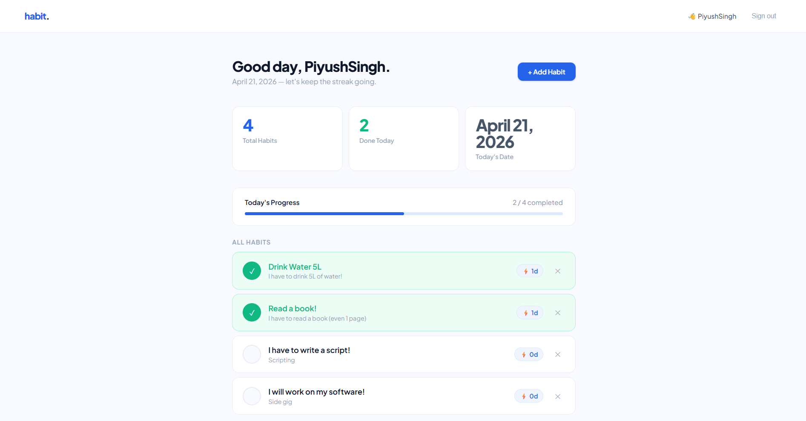
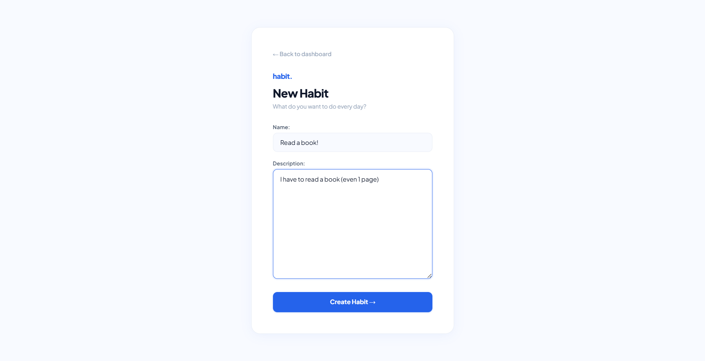
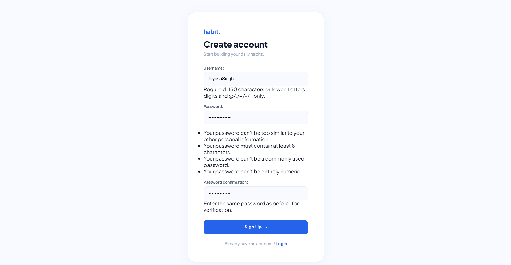

# 🧠 Habit Tracker

A clean and minimal **Django-based Habit Tracker** web app to help you stay consistent and build daily habits.

---

## 🚀 Features

- 🔐 User Authentication (Login / Signup / Logout)
- ➕ Add new habits
- ✅ Mark habits as completed daily
- 🔥 Streak tracking system
- 📊 Dashboard with progress insights
- 🧹 Delete habits
- 🎯 Clean & modern UI

---

## 🖼️ Screenshots

### 📊 Dashboard


---

### ➕ Add Habit


---

### 🔐 Signup Page


---

## 🛠️ Tech Stack

- **Backend:** Django (Python)
- **Database:** SQLite (default) / PostgreSQL (for deployment)
- **Frontend:** HTML, CSS (Custom UI)
- **Authentication:** Django Auth System

---

## ⚙️ Installation

### 1. Clone the repository

```bash
git clone https://github.com/YOUR_USERNAME/habit-tracker.git
cd habit-tracker
